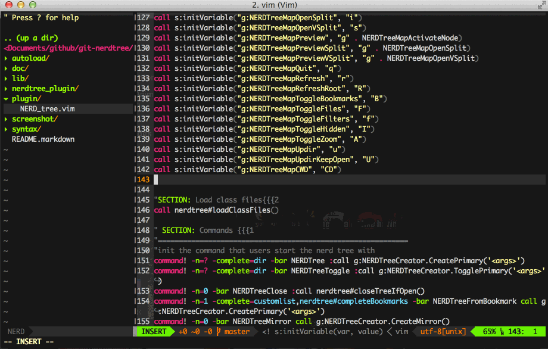

nerdtree-git-plugin
===================

A plugin of NERDTree showing git status flags. Works with the **LATEST** version of NERDTree.



Installation
------------

For [pathogen.vim](https://github.com/tpope/vim-pathogen):

```sh
git clone https://github.com/RobertAudi/nerdtree-git-plugin.git ~/.vim/bundle/nerdtree-git-plugin
```

For [Vundle](https://github.com/VundleVim/Vundle.vim):

```vim
Plugin 'scrooloose/nerdtree'
Plugin 'RobertAudi/nerdtree-git-plugin'
```

For [NeoBundle](https://github.com/Shougo/neobundle.vim):

```vim
NeoBundle 'scrooloose/nerdtree'
NeoBundle 'RobertAudi/nerdtree-git-plugin'
```

For [vim-plug](https://github.com/junegunn/vim-plug):

```vim
Plug 'scrooloose/nerdtree'
Plug 'RobertAudi/nerdtree-git-plugin'
```

FAQ
---

> How to config custom symbols?

Use this variable to change symbols.

```vim
let g:NERDTreeGitStatusIndicatorMap = {
      \   'Modified'  : '✹',
      \   'Staged'    : '✚',
      \   'Untracked' : '✭',
      \   'Renamed'   : '➜',
      \   'Unmerged'  : '═',
      \   'Deleted'   : '✖',
      \   'Dirty'     : '✗',
      \   'Clean'     : '✔︎',
      \   'Ignored'   : '☒',
      \   'Unknown'   : '?'
      \ }
```

> How to show `ignored` status?

```vim
let g:NERDTreeShowIgnoredStatus = 1
```

_Note: this is a heavy feature and may cost much more time_

Credits
-------

- [scrooloose](https://github.com/scrooloose): Open API for me.
- [git_nerd](https://github.com/swerner/git_nerd): Where my idea comes from.
- [PickRelated](https://github.com/PickRelated): Add custom indicators & Review code.
